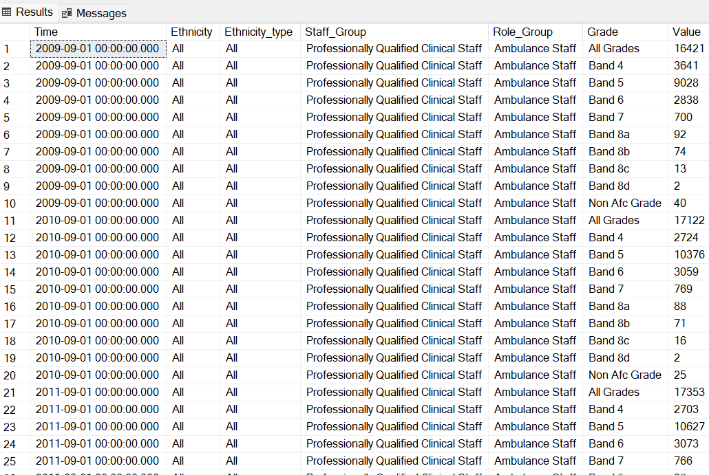

### 📊 NHS Workforce Data Analysis Using SQL

This project focuses on the analysis of NHS workforce data using SQL to extract meaningful insights into staffing patterns, role distribution, and temporal trends across different staff groups. By leveraging structured queries, the analysis enables filtering, aggregation, and segmentation of large datasets to identify key workforce dynamics—such as the growth or decline of specific roles, proportional changes in staff categories, and yearly variations in overall headcount. The ultimate objective is to transform raw data into actionable intelligence that can support strategic workforce planning, resource allocation, and policy decision-making within the healthcare sector.

### Query Summary and Insights

### 1. Task: Select all columns where the Role_Group is " Ambulance Staff"

```
select *

from [Workforce].[dbo].[nhs-workforce-data-june-2022]

where Role_Group = 'Ambulance Staff';
```




### 2. Task: Write a query to find the total number of staff in each Staff_Group for the year 2009.
```
SELECT Staff_Group, SUM(Value) AS Total_Staff
FROM [Workforce].[dbo].[nhs-workforce-data-june-2022]
WHERE YEAR(Time) = 2009
GROUP BY Staff_Group;
```

### 3. Task: Calculate the percentage of NHS Infrastructure Support staff relative to total staff for each time period.

```
SELECT 
    Time,
    SUM(CASE 
            WHEN Staff_Group = 'NHS Infrastructure Support' 
            THEN Value 
            ELSE 0 
        END) * 100.0 / SUM(Value) AS Infrastructure_Support_Percentage
FROM [Workforce].[dbo].[nhs-workforce-data-june-2022]
GROUP BY Time
ORDER BY Time;
```
### 4. Task: Select records where the Ethnicity is not "All."

```
SELECT *
FROM [Workforce].[dbo].[nhs-workforce-data-june-2022]
WHERE Ethnicity != 'All'
ORDER BY Time;
```
### 5: Task: Get a summary of total staff in each Role_Group for the most recent time period available (e.g., June 2022).

```
SELECT Role_Group, SUM(Value) AS total_staff
FROM   [Workforce].[dbo].[nhs-workforce-data-june-2022]
WHERE YEAR(Time) = 2022 AND MONTH(Time) = 6
GROUP BY Role_Group;
```
### 6. Task: Write a query to find the Grade with the highest number of staff for each Staff_Group.

```
SELECT 
    Staff_Group, 
    Grade, 
    MAX(Value) AS max_staff
	FROM 
  [Workforce].[dbo].[nhs-workforce-data-june-2022]
GROUP BY 
    Staff_Group, Grade
ORDER BY 
    Staff_Group;
```
### 7. Task: Get the total number of NHS staff for each year.

```
	SELECT 
    YEAR(Time) AS Year,
    SUM(Value) AS total_staff
FROM 
   [Workforce].[dbo].[nhs-workforce-data-june-2022]
GROUP BY 
    YEAR(Time)
ORDER BY 
    Year;
```

