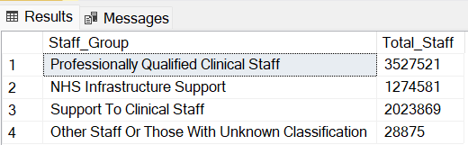
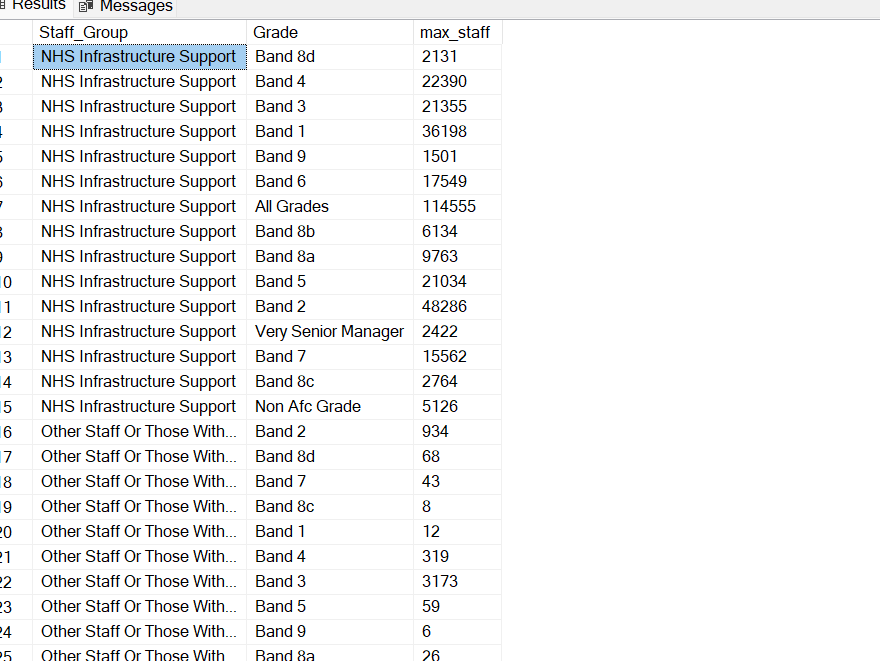

### 📊 NHS Workforce Data Analysis Using SQL

This project focuses on the analysis of NHS workforce data using SQL to extract meaningful insights into staffing patterns, role distribution, and temporal trends across different staff groups. By leveraging structured queries, the analysis enables filtering, aggregation, and segmentation of large datasets to identify key workforce dynamics—such as the growth or decline of specific roles, proportional changes in staff categories, and yearly variations in overall headcount. The ultimate objective is to transform raw data into actionable intelligence that can support strategic workforce planning, resource allocation, and policy decision-making within the healthcare sector.

### Query Summary and Insights

### 1. Task: Select all columns where the Role_Group is " Ambulance Staff"

```
select *

from [Workforce].[dbo].[nhs-workforce-data-june-2022]

where Role_Group = 'Ambulance Staff';
```


The data shows the workforce composition of Ambulance Staff within NHS.

### 2. Task: Write a query to find the total number of staff in each Staff_Group for the year 2009.
```
SELECT Staff_Group, SUM(Value) AS Total_Staff
FROM [Workforce].[dbo].[nhs-workforce-data-june-2022]
WHERE YEAR(Time) = 2009
GROUP BY Staff_Group;
```


The data reflects the total NHS staff across different groups in 2009, highlighting significant variations in staffing levels. Professionally Qualified Clinical Staff had the highest count at 3,527,521, indicating a substantial presence in this category. NHS Infrastructure Support followed with 1,274,581 staff, while Support to Clinical Staff totaled 2,023,869. In contrast, Other Staff or Those with Unknown Classification had the lowest count at 28,875. Overall, the data suggests a significant concentration of staff within the Professionally Qualified Clinical Staff category.
### 3. Task: Calculate the percentage of NHS Infrastructure Support staff relative to total staff for each time period.

```
SELECT 
    Time,
    SUM(CASE 
            WHEN Staff_Group = 'NHS Infrastructure Support' 
            THEN Value 
            ELSE 0 
        END) * 100.0 / SUM(Value) AS Infrastructure_Support_Percentage
FROM [Workforce].[dbo].[nhs-workforce-data-june-2022]
GROUP BY Time
ORDER BY Time;
```


### 4. Task: Select records where the Ethnicity is not "All."

```
SELECT *
FROM [Workforce].[dbo].[nhs-workforce-data-june-2022]
WHERE Ethnicity != 'All'
ORDER BY Time;
```


### 5: Task: Get a summary of total staff in each Role_Group for the most recent time period available (e.g., June 2022).

```
SELECT Role_Group, SUM(Value) AS total_staff
FROM   [Workforce].[dbo].[nhs-workforce-data-june-2022]
WHERE YEAR(Time) = 2022 AND MONTH(Time) = 6
GROUP BY Role_Group;
```


In June 2022, the NHS workforce was predominantly composed of staff in direct patient care and support roles. The largest group was Nurses & Health Visitors, with over 2.1 million staff, followed closely by Support to Doctors, Nurses & Midwives, which included nearly 1.9 million individuals. Scientific, Therapeutic & Technical Staff and Ambulance Staff were also significant, comprising over 1 million and 1.1 million staff respectively. HCHS Doctors accounted for approximately 797,000 employees.

Beyond clinical roles, substantial numbers were employed in operational and support areas such as Central Functions (680,000), Hotel, Property & Estates (442,000), and Support to ST&T Staff (502,000), highlighting the broad infrastructure supporting healthcare delivery. Leadership roles included around 145,000 Managers and 77,000 Senior Managers. Smaller groups included Midwives (156,000) and an Unknown category with fewer than 3,000 staff. Overall, the data reflects the NHS's reliance not just on medical professionals, but on a diverse and expansive workforce that enables the system to function at scale.

### 6. Task: Write a query to find the Grade with the highest number of staff for each Staff_Group.

```
SELECT 
    Staff_Group, 
    Grade, 
    MAX(Value) AS max_staff
	FROM 
  [Workforce].[dbo].[nhs-workforce-data-june-2022]
GROUP BY 
    Staff_Group, Grade
ORDER BY 
    Staff_Group;
```


### 7. Task: Get the total number of NHS staff for each year.

```
	SELECT 
    YEAR(Time) AS Year,
    SUM(Value) AS total_staff
FROM 
   [Workforce].[dbo].[nhs-workforce-data-june-2022]
GROUP BY 
    YEAR(Time)
ORDER BY 
    Year;
```


### 8. Task: Find the trend of staff in the Ambulance Staff role over time.

```
SELECT Time, SUM(Value) AS total_staff
FROM  [Workforce].[dbo].[nhs-workforce-data-june-2022]
WHERE Role_Group = 'Ambulance Staff'
GROUP BY Time
ORDER BY Time;
```


